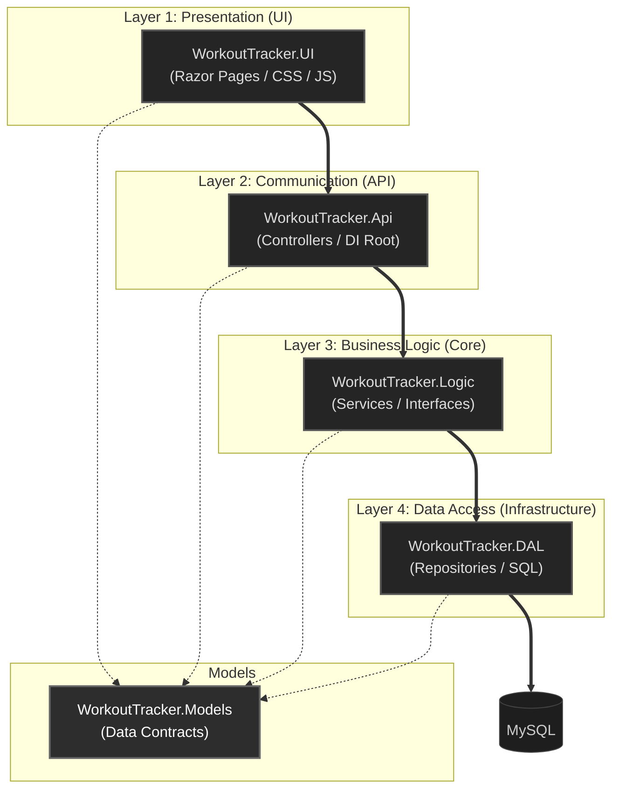

# RepVector Architecture Documentation

This document describes the 4-layer architecture of RepVector. The system is structured to ensure clear separation of concerns, where each layer has a distinct responsibility and communicates with others through defined boundaries.

---

## 1. The 4-Layer Stack

RepVector is organized into four primary logical layers. While the data flows vertically through these layers at runtime, we use Dependency Inversion to keep the core logic independent.



---

## 2. Layer Responsibilities

| Layer | Project | Role |
| :--- | :--- | :--- |
| **Layer 1** | **WorkoutTracker.UI** | Handles user interaction and displays data. It communicates with the API via HTTP clients. |
| **Layer 2** | **WorkoutTracker.Api** | Provides the entry point for the backend. It manages authentication, routing, and Dependency Injection registration. |
| **Layer 3** | **WorkoutTracker.Logic** | Contains the core business rules and authorization logic. It defines interfaces that the lower layers must implement. |
| **Layer 4** | **WorkoutTracker.DAL** | Manages data persistence. It executes raw SQL queries against the MySQL database. |

---

## 3. Dependency Inversion and Injection

To prevent the Business Logic (Layer 3) from being tightly coupled to the Database (Layer 4), we apply the Dependency Inversion Principle.

*   **The Contract:** Layer 3 defines what it needs (e.g., `IWorkoutRepository`).
*   **The Implementation:** Layer 4 implements that contract (e.g., `WorkoutRepository`).
*   **The Connection:** Layer 2 (API) acts as the "Electrician," registering these pairs in `Program.cs` so they can be injected at runtime.

```csharp
// WorkoutTracker.Api/Program.cs
builder.Services.AddScoped<IWorkoutRepository, WorkoutRepository>();
```

---

## 4. Development Workflow

When adding new features, follow the stack from the bottom up to ensure consistency:

1.  **Models:** Define the data structure in `WorkoutTracker.Models`.
2.  **DAL (Layer 4):** Implement the database operations in a Repository.
3.  **Logic (Layer 3):** Define the interface and implement the business service.
4.  **API (Layer 2):** Create the controller endpoint and register the DI.
5.  **UI (Layer 1):** Create the page and the API client to display the data.
