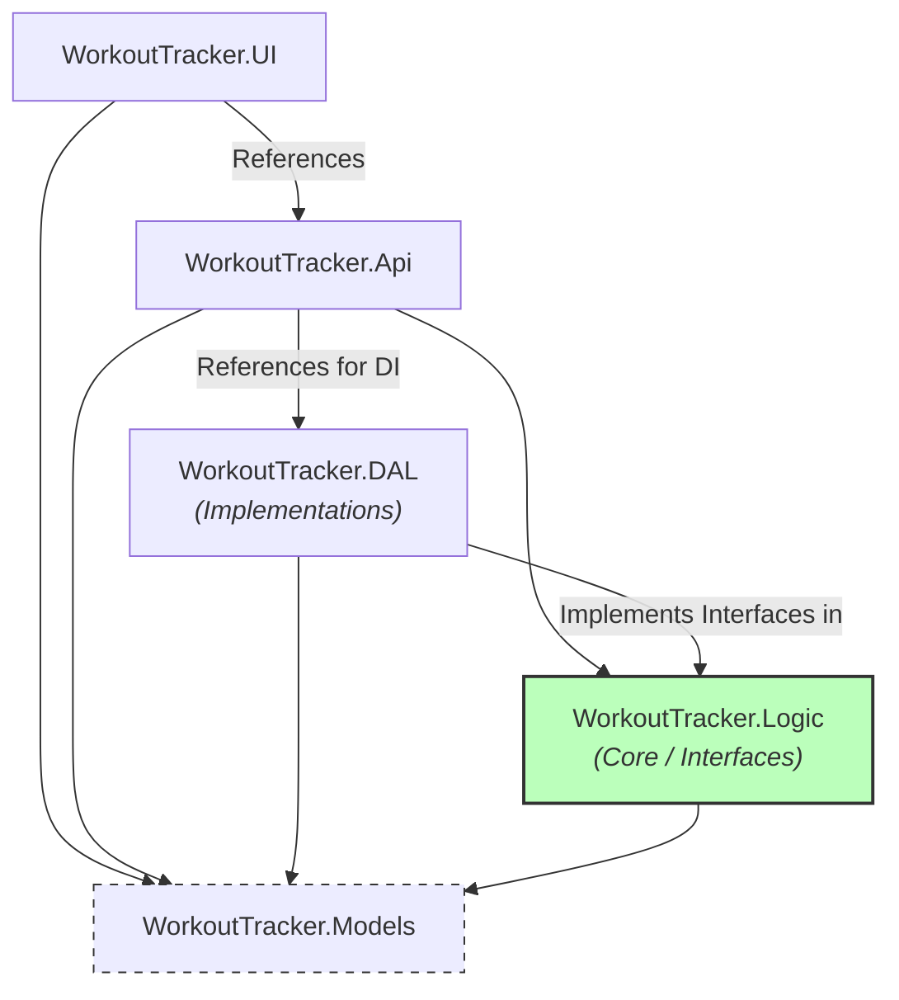
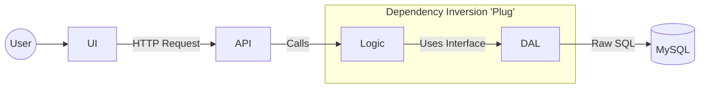
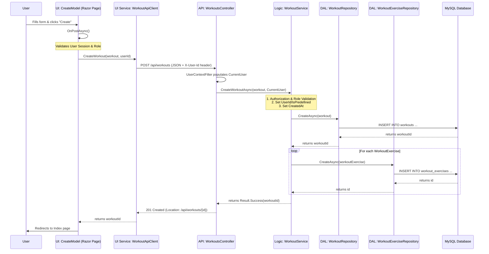

# RepVector Architecture Documentation

This document outlines the architectural structure of the RepVector application and provides a detailed example of the data flow through its layers.

## General Architecture

RepVector utilizes **Dependency Inversion**, a principle where high-level modules (Logic) do not depend on low-level modules (DAL). Instead, both depend on abstractions. In this project, these abstractions live within the Logic layer, making it the "Core" of the system.

### Project Dependency Diagram (Compile-time)
This diagram shows which projects reference each other. Note that the **DAL depends on Logic**, as it must implement the interfaces defined there.

### Logical Layering & Data Flow (Runtime)
While the compile-time code dependency points toward the Logic core, the **data flow** still moves through the layers. Dependency Injection (DI) allows the Logic layer to use DAL implementations at runtime without having a direct project reference to them.

### Architectural Principles Applied:
1.  **Dependency Inversion (DIP)**: The `WorkoutTracker.Logic` project defines repository interfaces (e.g., `IWorkoutRepository`). The `WorkoutTracker.DAL` project references `Logic` to implement these interfaces. This allows the Logic layer to remain "pure" and independent of the specific database technology.
2.  **Clean Architecture Influence**: By keeping the Business Logic as the core dependency, the application is easier to test and maintain. The UI and API are "external" layers that drive the core.
3.  **Cross-Cutting Models**: The `Models` project is a shared "Library" that defines the data contracts (POCOs) used by all tiers.

---

## Data Flow Example: Creating a Workout

The following sequence diagram illustrates the step-by-step flow of data when a user creates a new workout template.

### Key Files and Dependencies in the "Create Workout" Flow:

| Layer | File Path | Key Responsibility | Primary Dependencies |
| :--- | :--- | :--- | :--- |
| **UI** | `WorkoutTracker.UI\Pages\Workouts\Create.cshtml.cs` | Handles form submission and session-based role checks. | `WorkoutApiClient`, `ExerciseApiClient`, `Workout` |
| **UI Service** | `WorkoutTracker.UI\Services\WorkoutApiClient.cs` | Manages HTTP communication with the API. | `HttpClient`, `Workout` |
| **API** | `WorkoutTracker.Api\Controllers\WorkoutsController.cs` | Receives requests and delegates to the business logic layer. | `IWorkoutService`, `UserContext` |
| **Logic** | `WorkoutTracker.Logic\Services\WorkoutService.cs` | Orchestrates business rules, validation, and multi-repository updates. | `IWorkoutRepository`, `IWorkoutExerciseRepository`, `IExerciseRepository`, `IAuthorizationService` |
| **DAL** | `WorkoutTracker.DAL\Repositories\WorkoutRepository.cs` | Executes raw SQL to persist workout metadata. | `DbConnectionFactory`, `IWorkoutRepository` |
| **DAL** | `WorkoutTracker.DAL\Repositories\WorkoutExerciseRepository.cs` | Executes raw SQL to persist exercises linked to the workout. | `DbConnectionFactory`, `IWorkoutExerciseRepository` |
| **Models** | `WorkoutTracker.Models\Workout.cs` | Defines the structure of a Workout template. | - |

---

## The "Why" Behind the Architecture

Understanding the distinction between **Compile-time** (Source Code) and **Runtime** (Execution) dependencies is key to maintaining the RepVector codebase.

### 1. Compile-time (The "Blind" Principle)
At the source code level, the **Logic Layer is the Core**.
*   **Logic does not know about DAL**: The `WorkoutTracker.Logic` project has no reference to `WorkoutTracker.DAL`. It defines **Interfaces** (contracts) like `IWorkoutRepository`.
*   **DAL is a Plugin**: `WorkoutTracker.DAL` references `Logic` to implement those interfaces.
*   **Safety**: This prevents "leaking" database-specific code (like SQL) into the business logic. If you try to write a SQL query in the Logic layer, the code will not compile.

### 2. Runtime (The "Dependency Injection" Glue)
When the application is running, the **API Layer** acts as the glue.
*   **Startup Configuration**: In `Program.cs`, the DI container is configured to map interfaces to implementations:
    `builder.Services.AddScoped<IWorkoutRepository, WorkoutRepository>();`
*   **Dynamic Injection**: When a user makes a request, the API creates the `WorkoutService`. Because the service asks for an `IWorkoutRepository` in its constructor, the DI container automatically "injects" the `WorkoutRepository` from the DAL.
*   **Outcome**: The Logic layer executes database code at runtime without ever having a hard-coded reference to the DAL project at compile-time.

### 3. Benefits of this Design

*   **Testability**: We can write Unit Tests for the Logic layer by "mocking" the interfaces. We can test business rules (e.g., "only admins can create templates") in milliseconds without needing a real database.
*   **Maintainability (Swappability)**: If we decided to switch from MySQL to another database, we would only need to create a new DAL implementation and change one line in `Program.cs`. The UI, API, and Logic layers would remain untouched.
*   **Protection of Business Value**: Business rules are the most important part of the app. By isolating them in a "Pure" Logic layer, we protect them from being broken by changes in external "Tools" (like database updates or API framework changes).

**In summary: The "Rules" (Logic) control the "Tools" (DAL/UI), not the other way around.**

