# Logic Layer Class Diagram (v2.0 - Cleaned)

This diagram represents the actual class structure of the `WorkoutTracker.Logic` project, following strict HBO standards for clarity and precision.

```mermaid
classDiagram
    direction TB

    %% --- Service Implementations ---
    %% Stereotypes identify the Interface contract each service fulfills.

    class AuthService {
        <<IAuthService>>
        -IUserRepository userRepository
        +RegisterAsync(string email, string password) Task
        +LoginAsync(string email, string password) Task
        -HashPassword(string password) string
    }

    class WorkoutService {
        <<IWorkoutService>>
        -IWorkoutRepository workoutRepo
        -IWorkoutExerciseRepository weRepo
        -IExerciseRepository exRepo
        -IAuthorizationService auth
        +GetAllByUserIdAsync(int userId) Task
        +GetWorkoutDetailsAsync(int workoutId) Task
        +CreateWorkoutAsync(Workout w, User c) Task
        +UpdateWorkoutAsync(Workout w, User e) Task
        +DeleteWorkoutAsync(int id, User d) Task
    }

    class WorkoutSessionService {
        <<IWorkoutSessionService>>
        -IWorkoutSessionRepository sessionRepo
        -IWorkoutRepository workoutRepo
        -IAuthorizationService auth
        +GetActiveSessionAsync(int userId) Task
        +StartSessionAsync(int userId, int workoutId) Task
        +SaveSetLogAsync(WorkoutSetLog log, User u) Task
        +UpdateSessionStatusAsync(int id, string status) Task
    }

    class ExerciseService {
        <<IExerciseService>>
        -IExerciseRepository exerciseRepository
        -IAuthorizationService auth
        +GetAllAsync(int userId) Task
        +CreateAsync(Exercise e, User c) Task
        +UpdateAsync(Exercise e, User e) Task
        +DeleteAsync(int id, User d) Task
    }

    class PreferenceService {
        <<IPreferenceService>>
        -IUserPreferencesRepository repo
        -IAuthorizationService auth
        +GetPreferencesAsync(int userId) Task
        +SavePreferencesAsync(UserPreferences p, User e) Task
    }

    class AuthorizationService {
        <<IAuthorizationService>>
        +CanModifyWorkout(User u, Workout w) Result
        +CanModifyExercise(User u, Exercise e) Result
        +CanModifySession(User u, WorkoutSession s) Result
        +CanModifyPreference(User u, int targetId) Result
    }

    %% --- Repository Abstractions ---
    %% These are the contract points defined by the Logic Layer.

    class IUserRepository {
        <<interface>>
        +GetByEmailAsync(string email) Task
    }

    class IWorkoutRepository {
        <<interface>>
        +GetByIdAsync(int id) Task
        +CreateAsync(Workout w) Task
    }

    class IExerciseRepository {
        <<interface>>
        +GetByIdAsync(int id) Task
    }

    class IWorkoutSessionRepository {
        <<interface>>
        +GetActiveSessionByUserIdAsync(int userId) Task
    }

    class IUserPreferencesRepository {
        <<interface>>
        +GetByUserIdAsync(int userId) Task
    }

    %% --- Relationships: Dependency Injection ---
    %% Dotted lines represent runtime injection of repository interfaces.

    AuthService ..> IUserRepository : injected
    WorkoutService ..> IWorkoutRepository : injected
    WorkoutService ..> IExerciseRepository : injected
    WorkoutService ..> IAuthorizationService : injected

    WorkoutSessionService ..> IWorkoutSessionRepository : injected
    WorkoutSessionService ..> IWorkoutRepository : injected
    WorkoutSessionService ..> IAuthorizationService : injected

    ExerciseService ..> IExerciseRepository : injected
    ExerciseService ..> IAuthorizationService : injected

    PreferenceService ..> IUserPreferencesRepository : injected
    PreferenceService ..> IAuthorizationService : injected

    %% --- Visual Styling ---
    classDef service fill:#1b5e20,stroke:#c8e6c9,color:#fff
    classDef repo fill:#3e2723,stroke:#d7ccc8,color:#fff,stroke-dasharray: 5 5

    %% Applying styles individually to ensure 100% Mermaid compatibility

```

### Architectural Notes

1.  **Refined Class Names**: All "ghost" artifacts (like `AuthServiceService`) have been removed. The diagram reflects only the actual classes in your project.
2.  **Stereotypes over Interface Boxes**: To reduce visual clutter, interface implementation is shown via stereotypes (e.g., `<<IAuthService>>`) inside the implementation box.
3.  **Dependency Inversion**: Services depend strictly on Repository **interfaces**, ensuring the Business Logic remains decoupled from the Data Access implementation.
4.  **Complete Signatures**: All primary business methods and their parameters are included to provide a comprehensive view of the logic layer.
