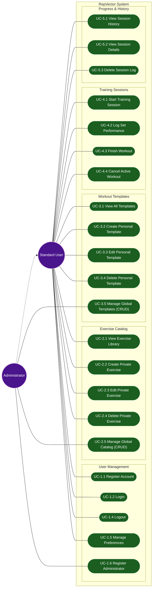

# RepVector Use Case Diagram

This diagram visualizes the interactions between users and the system, covering 100% of the application's core functionality.

### Actors Definition
*   **Standard User**: A person who uses the application to track their own personal fitness data and routines.
*   **Administrator**: A person with elevated privileges who can manage the global content available to all users. Inherits all capabilities of the Standard User.
