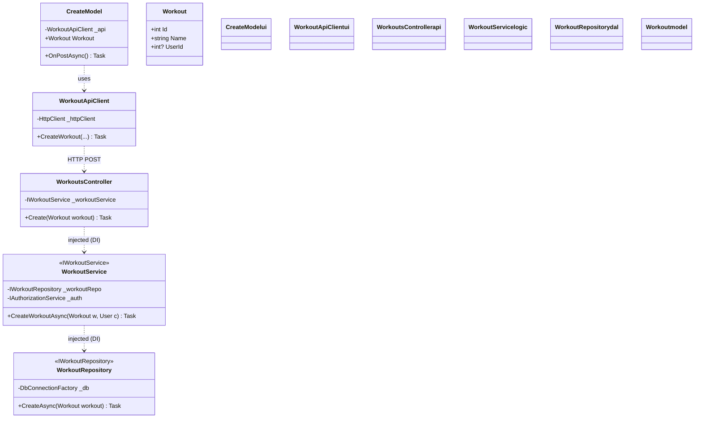

# Feature Class Diagram: Workout Creation

This diagram represents the "Vertical Slice" of the application for the **Workout Creation** feature, using stereotypes for cleaner visualization of layers.

### Architectural Notes:
*   **Stereotypes**: Classes are marked with stereotypes (e.g., `<<IWorkoutService>>`) to show they fulfill a specific interface contract without needing separate boxes.
*   **Vertical Slice**: Traces the flow from UI -> API -> Logic -> DAL for a single requirement.
*   **Color-Coding**: 
    *   **Purple**: Presentation Layer
    *   **Blue**: API Gateway
    *   **Green**: Business Logic
    *   **Brown**: Data Access
    *   **Dark Grey**: Shared Models
