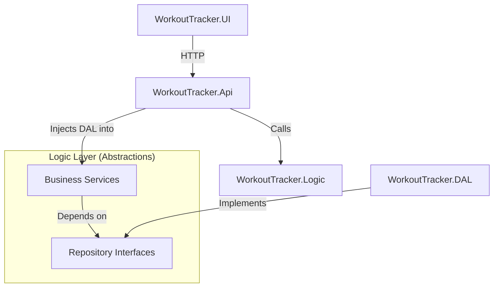

# RepVector

RepVector is a workout tracking system designed for managing exercise routines, performance logging, and progress analysis. The application allows users to build custom workout templates, browse a categorized exercise library, and track live training sessions.

## Core Features

### Workout Management
Users can create reusable workout plans by selecting exercises and defining target sets and repetitions. The system supports both personal routines and global templates provided by system administrators.

### Exercise Catalog
The platform maintains a library of exercises categorized by muscle groups. Users can contribute custom exercises to their own catalog or utilize the predefined master list.

### Session Tracking
Active workout sessions allow for real-time logging of performance data, including actual weight and repetitions completed. Finished sessions are archived in a historical log for future reference.

### Role-Based Authorization
The system implements role-based access control to distinguish between standard users and administrators. Admins manage the global exercise catalog and public templates, while users maintain full control over their personal data.

## System Architecture

The project follows a strictly decoupled four-layer architecture to ensure modularity and ease of maintenance. For a detailed breakdown of the internal mechanics and data flow, see the [Architecture Documentation](ARCHITECTURE.md).

1. **WorkoutTracker.UI**: A Razor Pages web application that handles user interaction and presentation logic.
2. **WorkoutTracker.Api**: An ASP.NET Core Web API that exposes RESTful endpoints and manages security and request routing.
3. **WorkoutTracker.Logic**: The business logic layer containing services for validation, authorization, and domain rules.
4. **WorkoutTracker.DAL**: The data access layer responsible for database interactions using raw SQL for high performance.

## Dependency Inversion

RepVector utilizes the Dependency Inversion Principle to decouple business logic from data access details. The Logic layer defines repository interfaces (abstractions) that describe the required data operations. The DAL layer implements these interfaces.

This approach ensures that the Logic layer remains independent of the specific database implementation or storage mechanism. The API layer serves as the composition root, where implementations are registered and injected into services at runtime.

### Architecture Drawing



## Technical Stack

* **Framework**: .NET 10
* **Web**: ASP.NET Core / Razor Pages
* **Database**: MySQL (using MySqlConnector)
* **Styling**: Bootstrap 5

## Getting Started

### Database Setup
1. Ensure a MySQL instance is running.
2. Execute the `repvector_master_setup.sql` script located in the root directory to initialize the database schema and seed initial data.

### Configuration
Update the connection string in the `appsettings.json` file within the `WorkoutTracker.Api` project:

```json
"ConnectionStrings": {
  "DefaultConnection": "Server=localhost;Database=repvectorprod;Uid=root;Pwd=yourpassword;"
}
```

### Running the Application
The solution contains multiple projects. To start the system, run both the `WorkoutTracker.Api` and `WorkoutTracker.UI` projects simultaneously.
